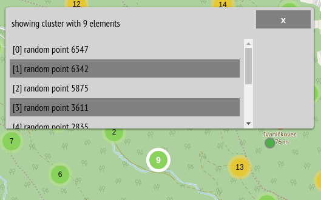

# Leaflet.MarkerCluster.List
**subplugin for the [Leaflet.MarkerCluster](https://github.com/Leaflet/Leaflet.markercluster) to display clustered child elements in the list**

### Options
 * **labelFn** (fn (element, element index, cluster) ) - function to handle how to display each element in the list
 * **headerFn** (fn (elements, cluster) ) - function to handle header
 * **headerFn** (fn (marker1, marker2) ) - implementation of markers sorting in list (see e.g. https://developer.mozilla.org/en-US/docs/Web/JavaScript/Reference/Global_Objects/Array/sort) 
 * **showHeader** (bool) - whether to display header
 * **sidePanel** (bool) - whether to show side panel with close button
 * **sidePanelWidth** (number) - width of side panel in px 
 * **list** (bool) - whether to apply this list rule or not 

### Notes:
 - suitable for mobile devices where display is too small to spiderfy clustered child elements on map

### Author:
 Adam Mertel | UNIVIE

### Demo:
 * [random data demo](https://adammertel.github.io/Leaflet.MarkerCluster.List/demo/demo1.html)
 * [combined with markercluster.placementStrategies](https://adammertel.github.io/Leaflet.MarkerCluster.List/demo/demo2.html)
